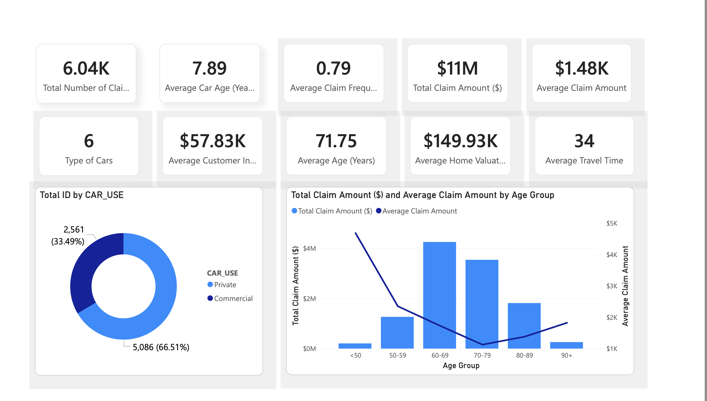

# Insurance Claims Analytics Dashboard (Power BI)

## Business Context

An insurance company aims to better understand claim patterns, customer demographics, and vehicle usage behavior in order to improve risk assessment and pricing strategies.

This Power BI dashboard analyzes auto insurance claims data to uncover trends in claim frequency, claim amount, customer characteristics, and vehicle usage.

---

## Objective

The goal of this analysis is to:

- Identify high-risk demographic segments  
- Understand claim frequency patterns  
- Analyze total and average claim amounts  
- Evaluate claim trends by car type and usage  
- Support data-driven underwriting and pricing decisions  

---

## Key KPIs

- **Total Number of Claims:** 6,040  
- **Total Claim Amount:** $11M  
- **Average Claim Amount:** $1.48K  
- **Average Claim Frequency:** 0.79  
- **Average Car Age:** 7.89 years  
- **Average Customer Age:** 71.75 years  
- **Average Home Valuation:** $149.93K  

---

## Dashboard Overview

The report includes:

### 1️⃣ Executive KPI Summary
- Total claims
- Total claim amount
- Average claim amount
- Customer and vehicle metrics

### 2️⃣ Claim Analysis by Age Group
- Total and average claim amount by age group
- Identification of high-risk age segments

### 3️⃣ Vehicle Usage Insights
- Claim distribution by car type (SUV, Pickup, Minivan, etc.)
- Commercial vs Private vehicle usage comparison

### 4️⃣ Demographic Risk Breakdown
- Claim amount by:
  - Education
  - Gender
  - Occupation
  - Car Type

### 5️⃣ Interactive Filters
- Age Group  
- Education  
- Gender  
- Occupation  
- Car Type  

---

## Tools Used

- **Power BI**
- Data Modeling
- DAX Measures
- Interactive Dashboard Design

---

## Dashboard Preview

## Business Impact

This dashboard enables senior management to:

- Detect high-risk customer segments  
- Adjust pricing models based on demographic patterns  
- Improve underwriting decisions  
- Optimize risk management strategies  

---

## File Included

- `Car Insurance Claim Analysis.pbix` – Power BI report file  
